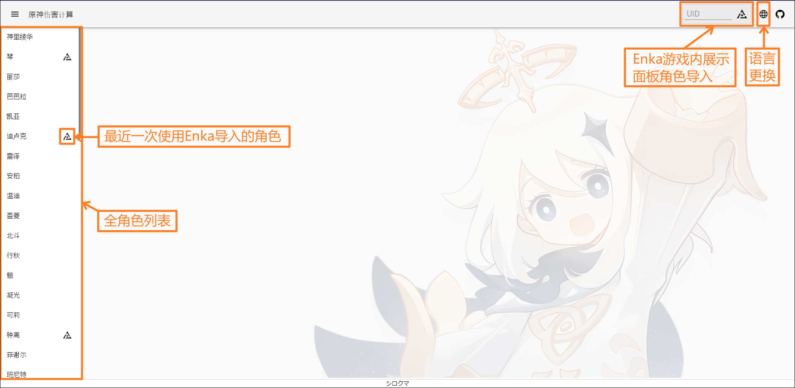
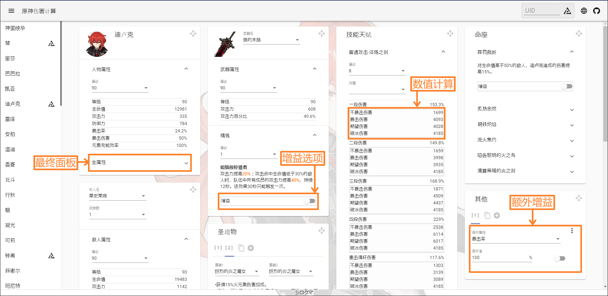

<p align="center">
    
<p>


## 介绍

+ 原神伤害计算

## 食用地址

+ <a href="https://genshin-calc.sirokuma.cc/" target="_blank">云原神</a> 或者 <a href="https://kurarion.github.io/Genshin-Calc/" target="_blank">Github Page</a> 

## 使用方法

<details>
    <summary>点击查看简单说明</summary>
    
    <br>
    
</details>

## 注意事项
■角色 

+ 角色天赋可控制BUFF默认关闭状态
+ 角色命座所有BUFF默认关闭状态

■武器
+ 武器效果可控制BUFF默认关闭状态

■圣遗物
+ 圣遗物四件套可控制BUFF默认关闭状态
+ 圣遗物仅支持20级5星圣遗物
+ 圣遗物用户自定义套装无数量上限，但通过Enka导入的数据时，如已超过10个则将自动替换最后一个套为Enka数据


## 其他
■整体
+ 所有用户数据使用浏览器的LocalStorage技术，暂时不支持自动清理

■敌人
+ 可能含有部分非正常敌人或缺少部分敌人

■武器
+ 只列举了3星及其以上的武器
+ 可能含有部分非正常武器（如鱼竿）

## 测试或搭建自己的计算器

■环境需求
+ <a href="https://nodejs.org/en/download/" target="_blank">Node.js</a> (推荐v16.15.0)
+ <a href="https://go.dev/dl/" target="_blank">Golang</a> (推荐1.16.3以上)

■本地构建
```
git clone https://github.com/Kurarion/Genshin-Calc.git
cd Genshin-Calc
npm install
npm run generateGenshinData //游戏版本更新后需再执行以获取最新数据并需向src/assets/init/data.json中追加新增内容配置
```
■启动
```
npm run start //npm run build
```
## 感谢
+ 特别感谢<a href="https://github.com/EnkaNetwork/API-docs/" target="_blank">Enka.Network</a>提供展示角色查询API
