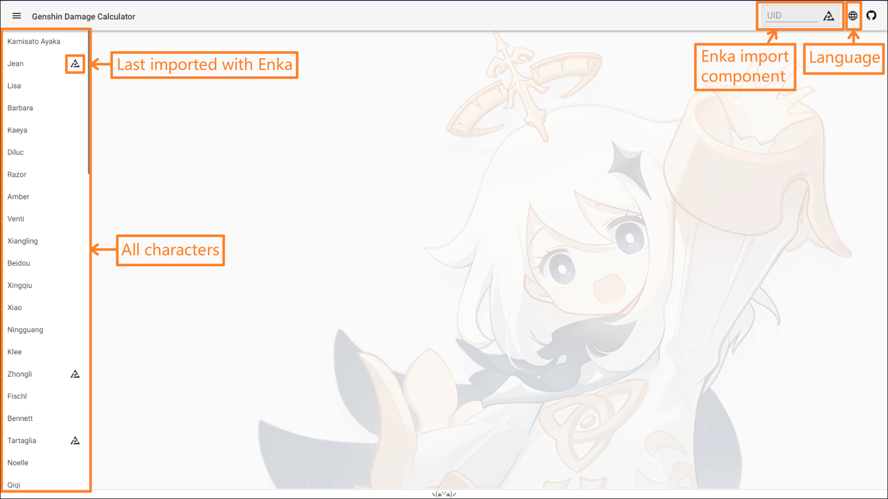
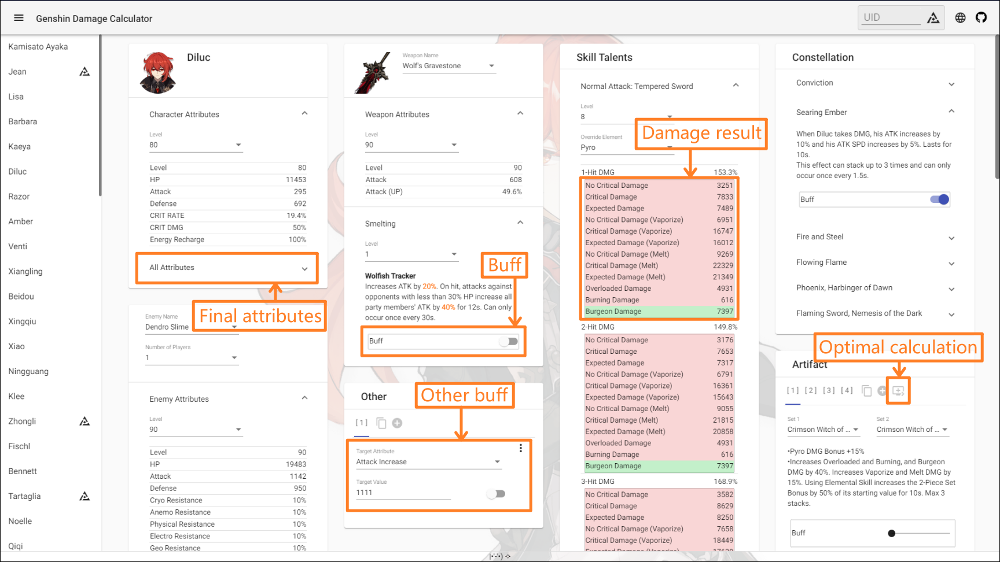
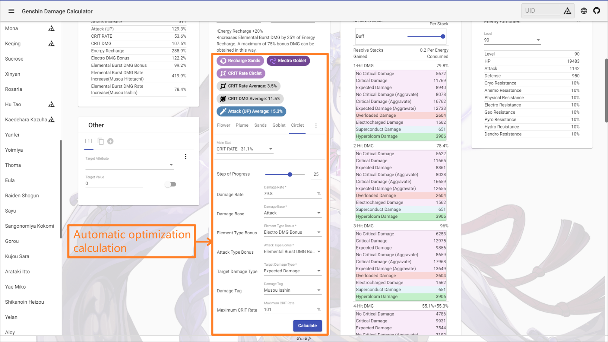

<p align="center">
    
<p>


<p align="center">
    English | 
    <a href="./README_CH_SIM.md">简体中文</a> | 
    <a href="./README_CH_TRA.md">繁體中文</a> | 
    <a href="./README_JP.md">日本語</a>
<p>

## Introduction
+ Genshin Impact damage calculation

## Try it
+  <a href="https://genshin-calc.sirokuma.cc/" target="_blank">Cloud Genshin Impact</a>

## Usage

<details>
<summary>Click to view a brief description</summary>

<br>

<br>

</details>

## Description
■ About character
+ All talent BUFFs are closed by default
+ All constellation BUFFs are closed by default

■ About weapon
+ Only weapons of 3 stars and above have been entered
+ The weapon effect BUFFs are closed by default

■ About artifact
+ The artifact BUFFs are closed by default
+ Only support level 20 5-star artifact
+ There is no upper limit on the number of user-defined sets of artifact, but when importing data through Enka, if there are more than 10 sets, the last set will be automatically replaced as Enka data

■ About automatic calculation of artifact
+ A step is defined as the maximum value of each increase (for example, the critical rate is 3.9%)
+ Be sure to check whether the BUFF which can override element is on before calculating (if you are calculating the override element damage)
+ The calculation is under the current environment, when any attribute or BUFF related to target calculation other than the number of step changes, it needs to be recalculated (such as the switch of weapon smelting or related BUFF on/off)
+ The automatic calculation does not consider the increase of value (attack value, HP value, defense value)

■ About artifact labels (growth/rarity)
+ The value of the growth/rarity tag can not evaluate the quality of a artifact very well, but simply evaluate the rarity of a artifact
+ Growth is non-linear, involving the difference between the growth value and growth times each increase, rather than the linear value of the final entry value. The larger the growth value and the more growth times, the higher the growth tag value, which means the closer to the King of XX (for example, the King of Defense)
+ The rarity is the sum of all growth, which means the difficulty of obtaining the artifact (the higher the value, the rarer), but it does not mean that the artifact are effective rare

## Other
■ About auto save
+ All user data uses the browser's LocalStorage technology, which temporarily does not support automatic cleaning

■ About enemy
+ May contain duplicate enemies

■ About weapon
+ May contain some weapons that cannot be obtained (such as trial weapon)

## Running Locally
■ Requirements
+ <a href="https://nodejs.org/en/download/" target="_blank">Node. js</a> (v16.15.0)
+ <a href="https://go.dev/dl/" target="_blank">Golang</a> (1.16.3)

■ Download
```
git clone https://github.com/Kurarion/Genshin-Calc.git
cd Genshin-Calc
npm install
npm run generateGenshinData
```
After the game version is updated, execute `npm run generateGenshinData` to obtain the latest data and append the updated content configuration to <a href="./src/assets/init/data.json" target="_blank">`src/assets/init/data.json`</a>

Interface reference: <a href="./src/app/shared/interface/interface.ts" target="_blank">`src/app/shared/interface/interfaces.ts`</a>

Constant reference: <a href="./src/app/shared/const/const.ts" target="_blank">`src/app/shared/const/const.ts`</a>

■ Test
```
//use angular-cli
npm run start
```
■ Build
```
//use http-server after building
npm run build
npm run serve
```
## Thanks
+ <a href="https://github.com/EnkaNetwork/API-docs/" target="_blank ">Enka.Network API</a>