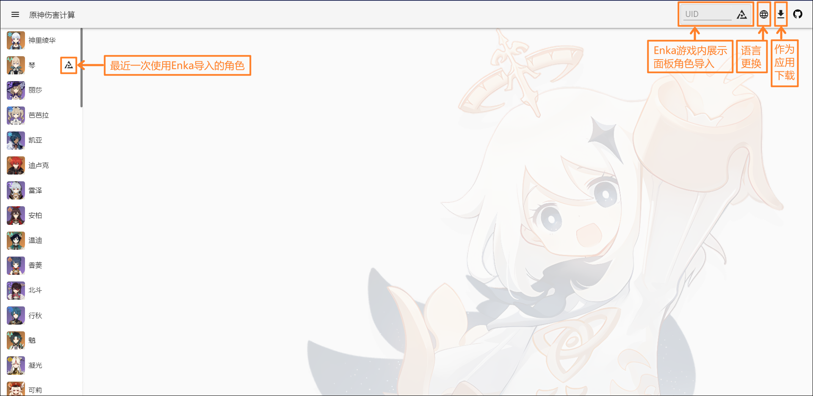
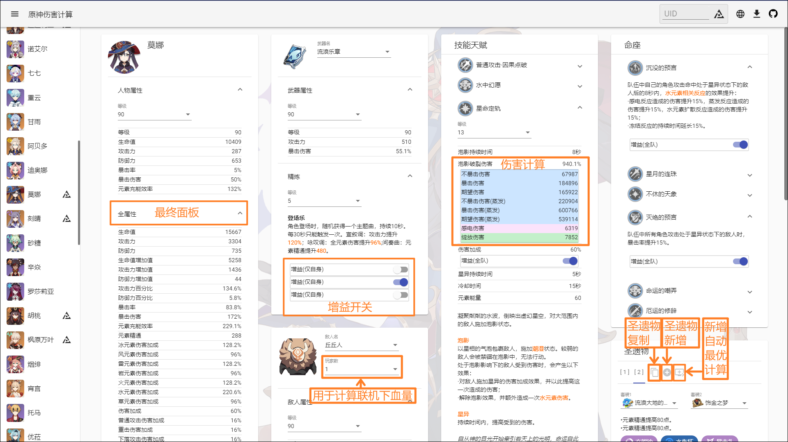
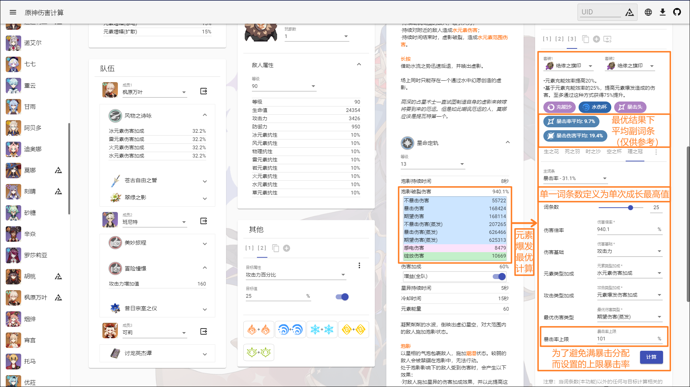

<p align="center">
    
<p>


<p align="center">
    <a href="./README.md">English</a> | 
    简体中文 | 
    <a href="./README_CH_TRA.md">繁體中文</a> | 
    <a href="./README_JP.md">日本語</a>
<p>

## 特色

+ 支持全角色与3星以上武器

+ 支持使用Enka.API（第三方游戏展示面板查询API）导入游戏展示面板角色数据（需在游戏中公开面板角色信息）

+ 数据实时计算以及数据自动保存

+ 支持队伍Buff（需要有要添加队伍角色的数据）

+ 支持自定义Buff，基本能满足各种需求

+ 圣遗物成长标签（娱乐向）

+ 圣遗物副词条最优化计算（自动平衡副词条占比）：

1. 通过将实际副词条占比向最优计算结果靠拢可以在限定词条数下最优化特定伤害
（注：由于实际各圣遗物词条数不一定完全相同，仅供提升参考）

2. 可以估测角色（特定武器，特定buff，特定队友下等）相同词条数下的相对强度
（注：仅提供各技能伤害，非DPS计算，手法以及操作轴需要通过其他途径计算）

+ 支持PWA，可安装及离线使用（注：离线情况下无法通过Enka导入角色信息与显示未缓存的图片）

## 食用地址

+ <a href="https://genshin-calc.sirokuma.cc/" target="_blank">"云"原神</a>

## 使用用例
<div>
    
    <br>
    
    <br>
    
    <br>
    
</div>

## 注意事项

■关于角色 

+ 角色天赋可控制BUFF默认关闭状态
+ 角色命座所有BUFF默认关闭状态

■关于武器

+ 仅录入了3星及其以上的武器
+ 武器效果可控制BUFF默认关闭状态

■关于圣遗物

+ 圣遗物四件套可控制BUFF默认关闭状态
+ 圣遗物仅支持20级5星圣遗物
+ 圣遗物用户自定义套装无数量上限，但通过Enka导入的数据时，如已超过10个则将自动替换最后一套设置为Enka数据

■关于圣遗物自动计算

+ 一个词条的定义为每次提升的最大值（如：暴击率为3.9%）
+ 计算前请务必检查附魔增益是否处于开启状态（如果计算为附魔后的伤害）
+ 计算为当前环境下的计算，即当词条数变更以外的任何与目标计算相关的属性或增益发生变化时，需要重新计算（如：武器精炼或相关增益的开关）
+ 自动计算不考虑小数值词条（小攻击，小生命，小防御）

■关于圣遗物标签（成长/稀有）

+ 成长/稀有标签值并不能很好地评价一个圣遗物的好坏与否，只是单纯评价一个圣遗物的稀有程度
+ 成长是非线性，涉及每次的成长值与成长次数，而并非最终词条数值的线性值差，越大的成长值且越多的成长次数可以显著提升成长标签值，意味着越接近XX之王（例如：防御之王）
+ 稀有度则是各成长度的总和，意味着圣遗物的获取难度（值越高越稀有），但并不意味着此圣遗物是有效的稀有

## 其他

■关于自动保存

+ 所有用户数据使用浏览器的LocalStorage技术，暂时不支持自动清理（手动清理流程`<Chrome>`：点击`菜单`旁`原神伤害计算`回到派蒙首页 -> 开发者工具`<F12>` -> `Application` -> `Storage` -> 点击[`Clear site data`] -> 刷新页面`<F5>`即可完成清理）

■关于敌人

+ 可能含有重复敌人

■关于武器

+ 可能含有部分无法获取武器（如活动试用武器）

## 本地搭建

■环境需求

+ <a href="https://nodejs.org/en/download/" target="_blank">Node.js</a> (推荐v16.15.0)
+ <a href="https://go.dev/dl/" target="_blank">Golang</a> (推荐1.16.3以上)

■本地构建

```
git clone https://github.com/Kurarion/Genshin-Calc.git
cd Genshin-Calc
npm install
npm run generateGenshinData
```
游戏版本更新后需再执行`npm run generateGenshinData`以获取最新数据并需向<a href="./src/assets/init/data.json" target="_blank">`src/assets/init/data.json`</a>中追加更新内容配置

接口参考: <a href="./src/app/shared/interface/interface.ts" target="_blank">`src/app/shared/interface/interface.ts`</a>

常量参考: <a href="./src/app/shared/const/const.ts" target="_blank">`src/app/shared/const/const.ts`</a>

■测试

```
//使用angular-cli
npm run start
```
■搭建
```
//build后使用http-server本地服务器
npm run build
npm run serve
```

## 感谢

+ <a href="https://github.com/EnkaNetwork/API-docs/" target="_blank">Enka.Network API</a>
