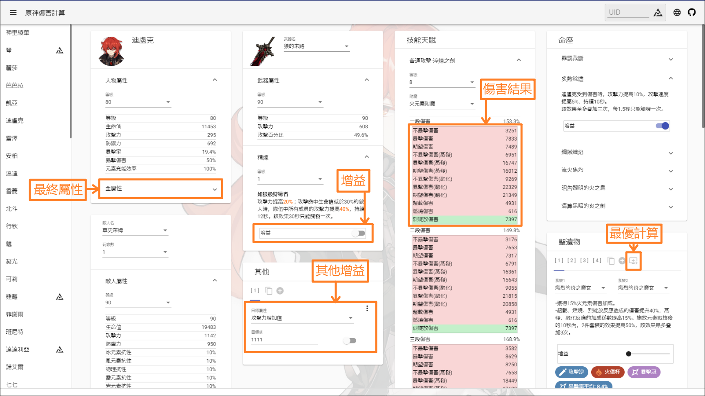
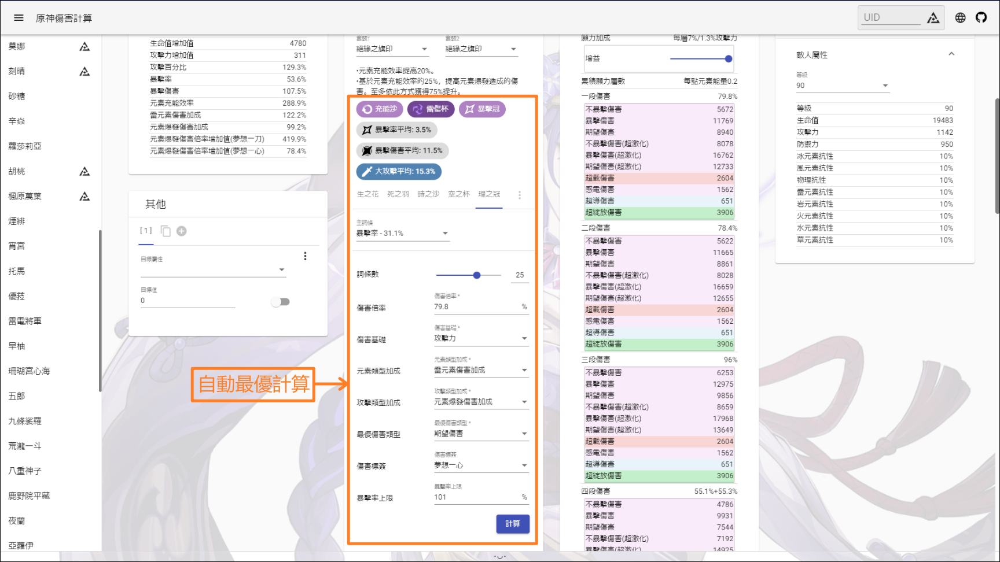

<p align="center">
    
<p>


<p align="center">
    <a href="./README.md">English</a> | 
    <a href="./README_CH_SIM.md">简体中文</a> | 
    繁體中文 | 
    <a href="./README_JP.md">日本語</a>
<p>

## 功能

+ 原神傷害計算

## 食用地址

+ <a href="https://genshin-calc.sirokuma.cc/" target="_blank">"雲"原神</a>

## 使用方法

<div>
    
    <br>
    
    <br>
    
</div>

## 注意事項

■關於角色 

+ 角色天賦可控制BUFF默認關閉狀態
+ 角色命座所有BUFF默認關閉狀態

■關於武器

+ 僅錄入了3星及其以上的武器
+ 武器效果可控制BUFF默認關閉狀態

■關於聖遺物

+ 聖遺物四件套可控制BUFF默認關閉狀態
+ 聖遺物僅支持20級5星聖遺物
+ 聖遺物用戶自定義套裝無數量上限，但通過Enka導入的數據時，如已超過10個則將自動替換最後一套設置為Enka數據

■關於聖遺物自動計算

+ 一個詞條的定義為每次提升的最大值（如： 暴擊率為3.9%）
+ 計算前請務必檢查附魔增益是否處於開啟狀態（如果計算為附魔後的傷害）
+ 計算為當前環境下的計算，即當詞條數變更以外的任何與目標計算相關的屬性或增益發生變化時，需要重新計算（如： 武器精煉或相關增益的開關）
+ 自動計算不考慮小數值詞條（小攻擊，小生命，小防禦）

■關於聖遺物標籤（成長/稀有）

+ 成長/稀有標籤值並不能很好地評價一個聖遺物的好壞與否，只是單純評價一個聖遺物的稀有程度
+ 成長是非線性，涉及每次的成長值與成長次數，而並非最終詞條數值的線性值差，越大的成長值且越多的成長次數可以顯著提升成長標籤值，意味着越接近XX之王（例如：防禦之王）
+ 稀有度則是各成長度的總和，意味着聖遺物的獲取難度（值越高越稀有），但並不意味着此聖遺物是有效的稀有

## 其他

■關於自動保存

+ 所有用戶數據使用瀏覽器的LocalStorage技術，暫時不支持自動清理

■關於敵人

+ 可能含有重複敵人

■關於武器

+ 可能含有部分無法獲取武器（如活動試用武器）

## 本地搭建

■環境需求

+ <a href="https://nodejs.org/en/download/" target="_blank">Node.js</a> (推薦v16.15.0)
+ <a href="https://go.dev/dl/" target="_blank">Golang</a> (推薦1.16.3以上)

■本地構建

```
git clone https://github.com/Kurarion/Genshin-Calc.git
cd Genshin-Calc
npm install
npm run generateGenshinData
```
遊戲版本更新後需再執行`npm run generateGenshinData`以獲取最新數據並需向<a href="./src/assets/init/data.json" target="_blank">`src/assets/init/data.json`</a>中追加更新內容配置

接口參考: <a href="./src/app/shared/interface/interface.ts" target="_blank">`src/app/shared/interface/interface.ts`</a>

常量參考: <a href="./src/app/shared/const/const.ts" target="_blank">`src/app/shared/const/const.ts`</a>

■測試

```
//使用angular-cli
npm run start
```
■搭建
```
//build後使用http-server本地服務器
npm run build
npm run serve
```

## 感謝

+ <a href="https://github.com/EnkaNetwork/API-docs/" target="_blank">Enka.Network API</a>