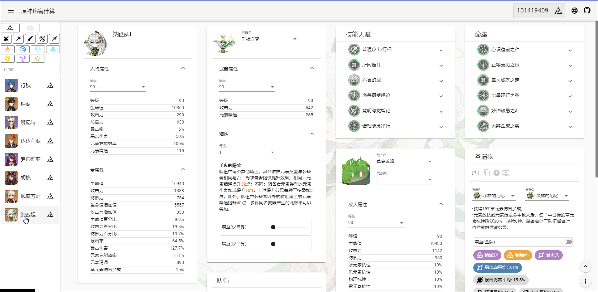
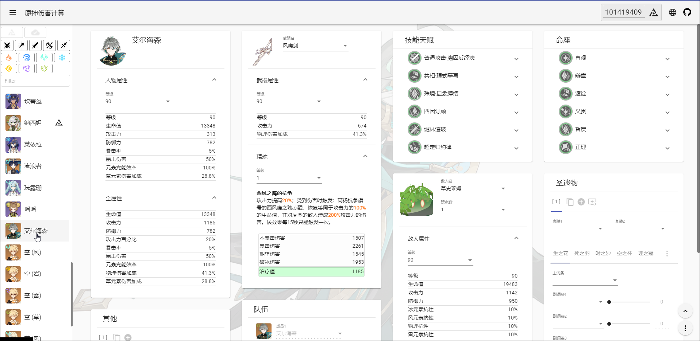

<p align="center">
    
    <br>
    <strong>インテイワット</strong>
<p>
<div align="center" style="display: flex;align-items: center;justify-content: center;gap: 0 5px;">
    <a href="https://discord.com/invite/GXjtmmFcYT">
        
    </a>
    <a target="_blank" href="https://qm.qq.com/cgi-bin/qm/qr?k=bi_PmMZ3t762gUCQ2CP1tOOzWbt7W1wx&jump_from=webapi&authKey=UPbPdmCHGuPomLNVj6uajaBwwk6G28u4mXCVr1ra5IRAtgJMy9TGDp+uFvGxJiHy">
        
    </a>
    <a href="https://github.com/Kurarion/Genshin-Calc">
        
    </a>
</div>
<p align="center">
    <a href="./README.md">English</a> | 
    <a href="./README_CH_SIM.md">简体中文</a> | 
    <a href="./README_CH_TRA.md">繁體中文</a> | 
    日本語
<p>

## アプリケーションの機能

+ すべてのキャラクター、3つ星以上の武器、**5つ星レベル20の聖遺物**の計算をサポート

+ Enka.API (パブリックなサードパーティのゲーム内展示キャラデータ取得API) を使用し、ゲーム展示キャラデータのインポートをサポート (展示情報をパブリックにする必要があります。)

+ データのリアルタイム計算とデータのローカル自動保存

+ すべてのスキルダメージ (反応を含む) の聖遺物サブ属性、武器の各精錬レベルの変化によるダメージ変化比較線

+ 補助キャラの実際のデータに基づいて計算されるチームバフ (補助キャラのデータを初期化またはインポートする必要があります。)

+ 豊富なカスタムバフ

+ 聖遺物成長タブ

+ 聖遺物のサブ属性の最適化計算（特定のスキル情報に従って、会心率の最大値を制限できる最適なサブ属性の割合を見つけます。）

1. 実際のサブ属性の割合を最適な計算結果に近づけることにより、限られた属性数で特定のダメージを最適化できる。
(注: 実際の聖遺物属性の数などは実現不可可能性があるため、主なプロモーション方向の参考です。)

2. キャラクターの強さ（特定の武器、特定のバフ、特定のチームメイトなど）を知りたいが、聖遺物の属性に関する具体的な情報がなく、細かい属性の選択が明確でない場合、この機能を使用し、聖遺物のメイン属性のみ限定、同じ量の属性を持つ各キャラクターの相対的な強さをすばやく推測できる。
(注: このプロジェクトは現在、DPS計算をサポートされていない、各スキルのダメージのみを提供しており、テクニックと操作軸は別の方法で計算する必要があります。)

+ ローカルにインストールでき、オフラインで使用可能なPWAアプリケーションである (注: ローカルにインストールされでも、Enka.API機能の使用と画像リソースの読み込みがインターネットに接続する必要があります。)

## アクセス

+ <a href="https://genshin-calc.sirokuma.cc/" target="_blank">インテイワット</a>

## 使用例
+ 申し訳ないです。現在は中国語版の例しか対応していないです。流れは変わらないので、ご参照ください。
<div>
     
     <br>
     
     <br>
     
</div>

## 説明

■キャラ

+ 天賦に制御可能なBUFFがデフォルトでオフになっている
+ 命ノ星座に制御可能なBUFFがデフォルトでオフになっている

■武器

+ 武器効果に制御可能なBUFFがデフォルトでオフになっている
+ 武器は3つ星以上の武器のみをサポート

■聖遺物

+ 聖遺物4点セットに制御可能なBUFFがデフォルトでオフになっている
+ レベル20の五つ星聖遺物のみをサポート
+ 聖遺物ユーザーカスタム組合せ数には上限がないが、Enkaにより導入する場合、10個を超えると自動的に最後の組合せをEnkaデータに置換る

■聖遺物最適化自動計算

+ 1つのステップの定義は、各成長の最大値です(例: 会心率3.9%)。小数点1桁まで指定できます(例: 0.1ステップは0.39%会心率に対応し、2.7%会心率は0.7ステップに対応します)。
+ 計算対象が元素付与後の通常攻撃ダメージの場合、計算前に通常攻撃の元素付与が付与された状態であることを必ず確認してください。
+ この計算はその場の環境に基づいて計算します。言い換えると、この機能にあるステップの調整以外に、ダメージ計算に関連する属性またはバフが変更された場合、再計算する必要があります (武器の精錬または関連するバフの操作など)。
+ 自動計算のリソースオーバーヘッドを削減するため、現在の小数値の属性は計算に含めません (攻撃値、HP値、防御値)。

■聖遺物タグ（成長・レア）

+ 成長/レアタグ値は聖遺物の品質を正しく評価する機能ではなく、単に聖遺物のレア性を評価するものです（初期値と+4以降の各増加の値）。
+ 成長とは、各成長値と成長回数を含む非線形であり、最終属性値の線形値の差ではありません. 成長値が大きく、成長回数が多いほど、成長タグ値が大きくなります。○○のキングに近くことを意味します（例：防御が35.7%の聖遺物）。
+ レアリティとは、各成長率の合計であり、聖遺物の入手・強化の難易度（数値が高いほどレア度が高い）を意味し、聖遺物が有効的なレア（ダメージに役立つ）というわけではありませんが、レアリティ100%以上の聖遺物をドッグフードとして扱うのは絶対にダメだと思います٩(ˊᗜˋ*)و

## その他

■オートセーブ

+ すべてのデータはブラウザのLocalStorageを使用しており、右下のメニュー「・・・」の「データクリア」からデータをリセットできます。

## ローカル構築

このプロジェクトは`Angular`を使用し、開発されたバックエンドなしのWebアプリケーションです。このプロジェクトのみでローカル構築可能です。手順は以下となります。

■環境

+ <a href="https://nodejs.org/en/download/" target="_blank">Node.js</a> (推奨 v16.15.0)
+ <a href="https://go.dev/dl/" target="_blank">Golang</a> (1.16.3 以上を推奨)

■ダウンロード

```
git clone https://github.com/Kurarion/Genshin-Calc.git
cd Genshin-Calc
npm install
```
■ゲームデータの初期化

DimbreathのGithubリポジトリは制裁を受けたため、以下のコマンドを直接使用することができなくなりました。
```
npm run generateGenshinData
```
他のGenshin DataのRaw URLかローカルファイルを使うといいかもしれません。
+ Grasscutter Resourcesなどの他のGenshin DataリポジトリのRaw URLを使用
```
go run GenshinData -resUrl=https://gitlab.com/????/GC-Resources/-/raw/3.?/Resources/
```
+ ローカルファイルを使用
```
go run GenshinData -localResPath=./GenshinData
```
ゲームのバージョンアップデート後、またはテストデータやカスタムデータを使用する場合は、`「ゲームデータの初期化」`を再実行し、プロジェクトに必要な最新データを生成し、<a href="https://github.com/Kurarion/Genshin-Calc/tree/main/src/assets/init/data.json" target="_blank">`src/assets/init/data.json`</a>に更新内容の設定を追加する必要があります。

インターフェイス参照: <a href="https://github.com/Kurarion/Genshin-Calc/tree/main/src/app/shared/interface/interface.ts" target="_blank">`src/app/shared/interface/interface.ts`</a>

定数参照: <a href="https://github.com/Kurarion/Genshin-Calc/tree/main/src/app/shared/const/const.ts" target="_blank">`src/app/shared/const/const.ts`</a>

■テスト

```
//angular-cli を使用
npm run start
```
■構築
```
//buildした後、http-serverを使用する
npm run build
npm run serve
```

## 感謝
+ <a href="https://github.com/EnkaNetwork/API-docs/" target="_blank">Enka.Network API</a>
