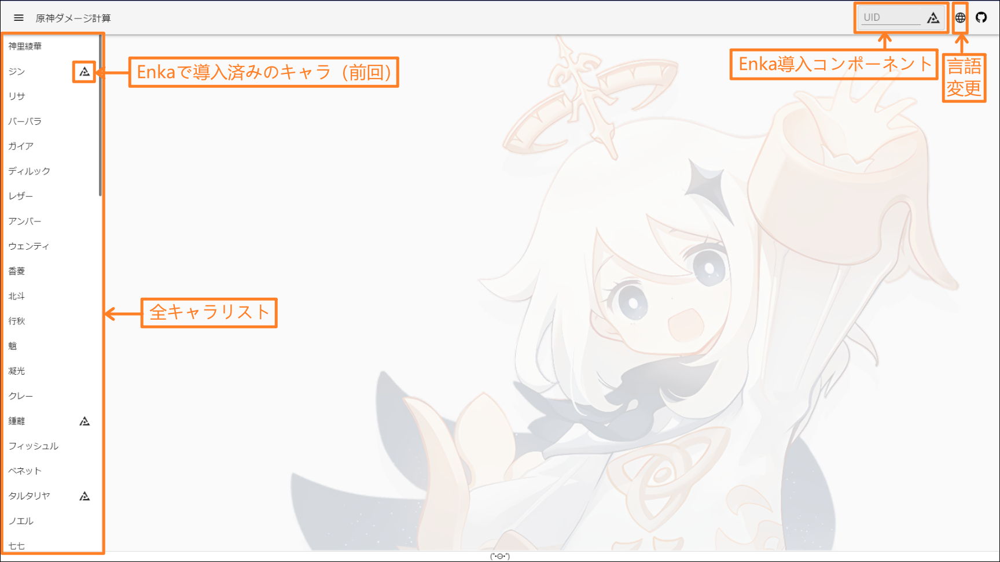
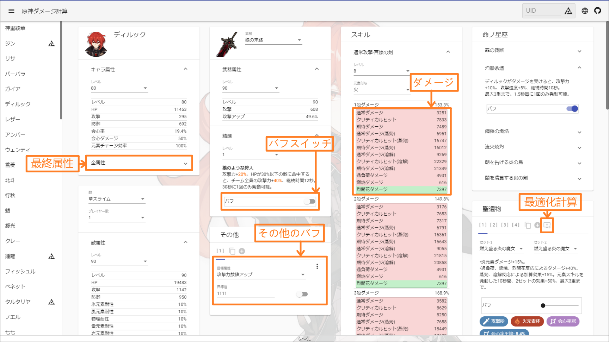
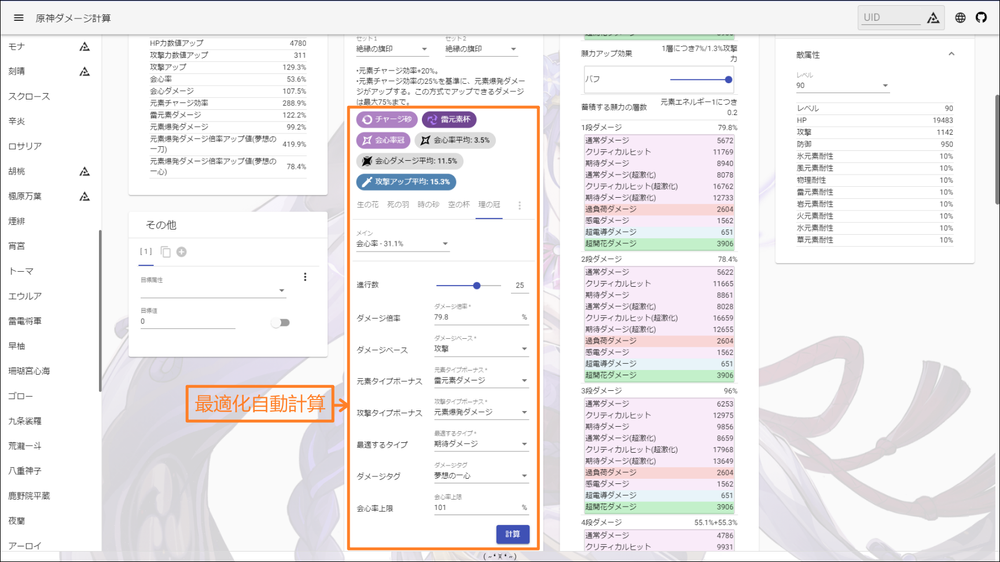

<p align="center">
    
<p>


<p align="center">
    <a href="./README.md">English</a> | 
    <a href="./README_CH_SIM.md">简体中文</a> | 
    <a href="./README_CH_TRA.md">繁體中文</a> | 
    日本語
<p>

## 機能
+ 原神ダメージ計算

## アクセス
+ <a href="https://genshin-calc.sirokuma.cc/" target="_ブランク">クラウド原神</a>

## 使用方法

<details>
<summary>簡単な説明</summary>

<br>

<br>

</details>

## 注意事項
■キャラクターについて
+ 天賦に制御可能なBUFFがデフォルトでオフになっている。
+ 命ノ星座に制御可能なBUFFがデフォルトでオフになっている。

■武器について
+ 三つ星以上の武器の提供のみ。
+ 武器効果に制御可能なBUFFがデフォルトでオフになっている。

■聖遺物について
+ 聖遺物4点セットに制御可能なBUFFがデフォルトでオフになっている。
+ レベル２０の五つ星聖遺物の提供のみ。
+ 聖遺物ユーザーカスタム組合せ数には上限がないが、Enkaにより導入する場合、10個を超えると自動的に最後の組合せをEnkaデータに置換る。

■聖遺物最適化計算について
+ 1つの進行数の定義は、成長の最大値と定義する。（例：クリティカル率が3.9%）
+ 元素付与後のダメージを計算する場合、計算する前に必ず元素付与に関するBUFF状態をオンにする。
+ 実際の環境で計算を行る。進行数の変更以外、ターゲット計算に関連する属性やBUFF（武器レベル変更など）が変化した場合、再計算する必要がある。
+ 自動計算は数値（攻撃値、生命値、防御値）の成長を考慮しない。

■聖遺物ラベル（成長/レア）について
+ 成長/レアラベル値は、1つの聖遺物の良し悪しをうまく評価することができない。単純に1つの聖遺物のレア度を評価するのみ。
+ 成長は非線形であり、最終的な成長値の線形差ではなく、毎回の成長値と成長回数に関連し、成長値が大きく、成長回数が多いほど成長ラベル値を著しく向上させることができ、○○のキング（例：防御のキング）に近づくことを意味する。
+ レア度は各成長の総和であり、聖遺物の入手困難さを意味するが、この聖遺物が有効なレアであることを意味するわけではない。

## その他
■自動保存について
+ すべてのユーザーデータはブラウザのLocalStorageを使用し、自動クリーンアップは現在サポートされていない。

■敵について
+ 同じ敵が含まれる可能性がある。

■武器について
+ イベント試用武器などの取得できない武器が含まれている可能性がある。

## ローカル構築
■環境
+  <a href="https://nodejs.org/en/download/" target="_blank">Node.js</a>（推奨v16.15.0）
+  <a href="https://go.dev/dl/" target="_blank">Golang</a>（推奨1.16.3以上）

■ダウンロード
```
git clone https://github.com/Kurarion/Genshin-Calc.git
cd Genshin-Calc
npm install
npm run generateGenshinData
```

ゲームバージョンが更新されるたびに `npm run generateGenshinData` を実行して最新データを取得する。また<a href="./src/assets/init/data.json" target="_blank">`src/assets/init/data.json`</a>に更新内容についての設定を追加する必要がある。

インタフェース参照：<a href="./src/app/shared/interface/interface.ts" target="_blank">`src/app/shared/interface/interface.ts`</a>

定数参照：<a href="./src/app/shared/const/const.ts" target="_blank">`src/app/shared/const/const.ts`</a>

■テスト
```
//angular-cliを使用する
npm run start
```

■構築
```
//buildした後、http-serverを使用する
npm run build
npm run serve
```
## 感謝
+ <a href="https://github.com/EnkaNetwork/API-docs/" target="_blank">Enka.Network API</a>
