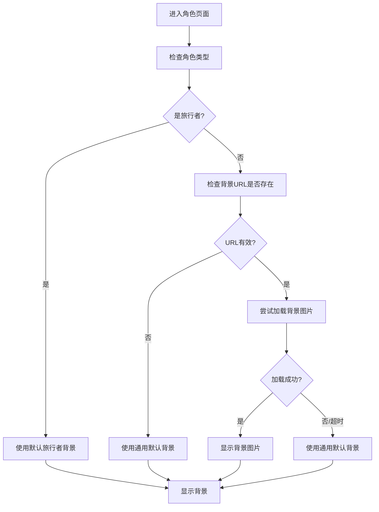

# 背景图片加载优化设计

## 架构设计

### 1. 背景图片处理流程



### 2. 组件结构

#### BackgroundImageService (新增)
```typescript
@Injectable()
export class BackgroundImageService {
  // 检查图片URL有效性
  validateImageUrl(url: string): Promise<boolean>

  // 加载图片并处理错误
  loadImageWithFallback(url: string, fallbackUrls: string[]): Promise<string>

  // 获取角色默认背景
  getDefaultBackground(characterId?: string): string

  // 检查是否为旅行者
  isTravelerCharacter(characterId: string): boolean
}
```

#### 修改 MainComponent
- 注入 BackgroundImageService
- 重构 `initializeBackGroundImage()` 方法
- 添加加载状态和错误状态处理

### 3. 配置设计

#### 默认背景配置
```typescript
export interface BackgroundConfig {
  defaultBackground: string;      // 通用默认背景
  travelerBackground: string;     // 旅行者专用背景
  fallbackList: string[];         // 备用背景列表
  timeoutDuration: number;        // 加载超时时间 (ms)
}
```

## 实现细节

### 1. 预验证机制
在发起图片请求前，先检查URL的格式和有效性：
- 检查URL是否为有效格式
- 对于已知的问题角色（如旅行者），直接使用默认背景
- 可选：预检查URL是否返回200状态码

### 2. 超时处理
设置图片加载超时时间，避免长时间等待：
```typescript
private loadImageWithTimeout(url: string, timeout: number = 5000): Promise<Blob | null> {
  return Promise.race([
    this.httpService.get<Blob>(url, 'blob', true, false),
    new Promise<null>((_, reject) =>
      setTimeout(() => reject(new Error('Loading timeout')), timeout)
    )
  ]);
}
```

### 3. 渐进式加载策略
1. 首先尝试加载原始背景图片
2. 如果失败或超时，立即切换到默认背景
3. 显示加载状态指示器（可选）
4. 平滑的背景切换动画

### 4. 错误处理和监控
```typescript
private handleBackgroundLoadError(error: Error, characterId: string) {
  console.warn(`Failed to load background for character ${characterId}:`, error);
  // 可以添加错误监控和上报逻辑
  this.analyticsService.reportBackgroundLoadError(characterId, error);
}
```

## 性能考虑

### 1. 缓存策略
- 缓存已成功加载的背景图片URL
- 缓存已知的问题角色列表
- 使用内存缓存避免重复验证

### 2. 资源优化
- 默认背景图片应该轻量级，快速加载
- 使用适当的图片格式和压缩
- 考虑使用CSS渐变或图案作为备选方案

### 3. 用户体验
- 保持现有的加载动画，但确保最终总是有背景显示
- 避免背景切换时的闪烁
- 确保在不同网络条件下都能正常工作

## 测试策略

### 1. 单元测试
- BackgroundImageService 的各个方法
- 不同场景下的错误处理逻辑
- 超时机制的正确性

### 2. 集成测试
- 旅行者角色的背景显示
- 网络错误情况下的fallback
- 背景图片加载性能测试

### 3. 边界测试
- 极慢的网络环境
- 无效的URL格式
- 内存限制情况下的表现